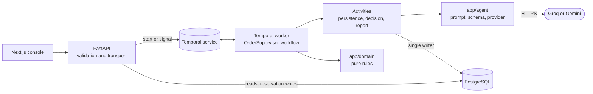

# Architecture note

Order Supervisor is a proof of concept for a long-running AI supervisor that watches a
single e-commerce order from creation to completion. One Temporal workflow supervises one
order for its entire life. It wakes to reason at three points: on start, on an important
event, and on a scheduled review, staying asleep otherwise.

## Components

One Python application runs in two roles, API and worker, against one Temporal service and
one Postgres database. The console only talks to FastAPI, and only `app/agent/` talks to a
model. Postgres holds the recorded read view; Temporal holds execution history. The console
reads Postgres rather than querying Temporal, so the recorded view remains available while
the Temporal worker restarts.

## Lifecycle

Creating an order reserves its identity in Postgres, then starts a Temporal workflow whose
ID is derived from that identity. The two systems do not share a transaction, so an
unconfirmed start is reported instead of risking a duplicate order. After that, commands
only signal the existing workflow. Four signal types carry them: an order event, an
operator instruction, a control command (interrupt, pause, resume, or terminate), and a
customer-draft review (approve or reject).

Inside the loop, the workflow checks its age deadline, drains queued commands, applies
closing rules, and classifies new evidence. Only initialization, an important event, or a
scheduled review starts a bounded model call. Its answer is a proposal containing a
rationale, up to five action requests, and a sleep decision. Before recording an action,
the workflow drains events that arrived during the call and authorises the proposal against
the current state.
Only workflow rules can close a run: delivery, manual termination, or maximum age. The model
may recommend closure but cannot perform it.

## Ownership

| Concern | Owner |
|---|---|
| Validation and transport | FastAPI |
| When anything happens | Temporal |
| Every run-state write after reservation | one activity (`commit_transition`) |
| What an event means | `app/domain/events.py` |
| Whether to wake | `app/domain/policy.py` |
| Whether a proposal may execute | `app/domain/authorization.py` |
| When supervision ends | the workflow |

## Memory vs. continuation

The design bounds model context and Temporal history separately:

| | Working memory | Continue-as-new |
|---|---|---|
| Bounded thing | what one model call can hold | one Temporal execution's history |
| Refreshed by | enough recorded change | history length |
| Preserves | source facts, instructions, and receipts | application run ID, workflow ID, original deadlines, pause state |

A summary is a compressed narrative, not the source of truth. Facts come from event rules,
restrictions from operator commands, and simulated actions from committed receipts.

## Actions and receipts

The five required business actions are simulations; nothing is emailed or sent externally.
For this POC, executing an action means committing a receipt to the activity log. A proposal
is committed, blocked with a reason (`executed: false`), or held for human approval. Retrying
a committed action returns its original receipt instead of duplicating it. A repeat message
about an unchanged concern is refused until new evidence arrives or the configured follow-up
window expires.

## Trade-offs

- Postgres and Temporal have separate authority. Temporal schedules work; Postgres stores
  the application record. A start spans both systems, so an uncertain start remains visible
  as `starting`.
- Business rules live outside the workflow as plain functions, so they can be tested
  without Temporal. The workflow itself stays a thin, deterministic loop.
- Closing first renders a factual report, then optionally asks the model for prose and
  checks it against the record. Provider failure only removes the optional narrative.
- Only one model call is in flight per order at a time; events queue rather than race it.
- This is a local proof of concept: no auth, no multi-tenancy, no real commerce or
  messaging integration.
